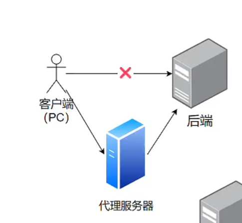
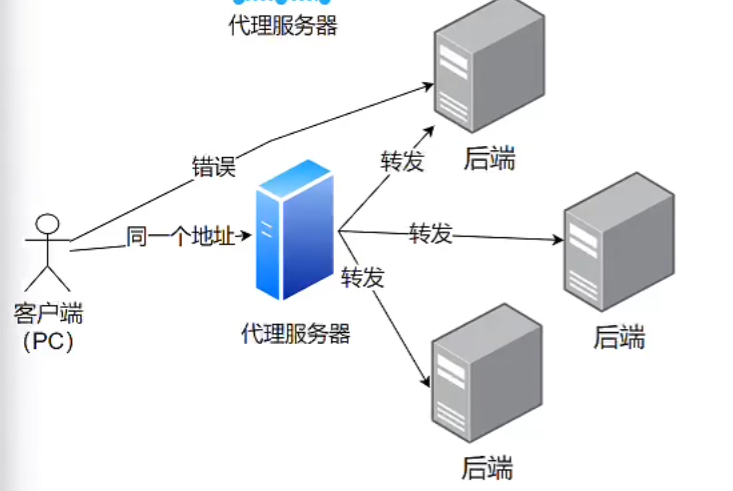

# **用户中心项目**

## 待优化内容

* 注册功能：账户重复时提示不友好，注册页面不能直接返回登录界面


## 前端初始化

* Ant design pro


## 后端初始化

* spring boot（创建初始工程，配置application.yml，连接数据库（创建数据库）
* mybatis plus


## 数据库设计

### 需要思考的问题？

1. 有哪些表？
2. 表中有哪些字段？
3. 字段的类型？
4. 是否给字段添加索引？

### 用户表

开闭原则（对扩展开放，对修改关闭）

* id（主键） bigint

* username 用户名 varchar(256)

* gender 性别 tinyint

* avatarUrl 头像url varchar(1024)

* userAccount 账号 varchar(256)

* userPassword 密码 varchar(512) 非空

* phone 电话 varchar(128)

* Email 邮箱 varchar(512)

* userStatus 用户状态 int 0 - 正常（默认）非空

  ***

一般来说，表的必备字段：

* createTime 创建时间 datetime

* updateTime 更新时间 datetime
* isDelete 是否删除（逻辑删除，通过0和1表示该条数据是否有效） tinyint 0 - 未删除（默认）


## 登录、注册

### 后端

1. 创建项目目录

2. 实现基本数据库操作
   1. 创建user对象（model），用于映射数据库中的各个字段，自动生成（mybatisX插件）
   2. 测试，实现基本数据库操作

3. 注册逻辑
   1. 用户在前端输入账户、密码以及校验码（todo）
   2. 校验用户的账号密码是否符合要求
      1. 非空
      2. **引入Apache Common Utils（Apache Commons  Lang）**
      3. 账户长度**不小于**4位
      4. 账户不能重复
      5. 密码**不小于**八位
      6. 账户不包含特殊字符
      7. 密码需要加密
      8. 密码和校验码相同
   3. 向数据库插入数据

4. 登录逻辑

   1. 用户提交数据，post请求，请求体：json格式数据

      > 请求参数很长时不建议用get

      1. 账户
      2. 密码
      3. 返回值：用户信息（**脱敏**）

   2. 校验用户账户，密码

      1. 非空
      2. 账户长度**不小于**4位
      3. 密码**不小于**八位
      4. 账户不包含特殊字符

   3. 将密码进行加密

   4. 从数据库查出账户、密码与前端提交过来的数据进行比对

      > 逻辑删除的用户不能查出来（使用mybatis plus框架进行约束，在配置文件进行配置，并对逻辑删除字段（表对应实体类的字段）添加@TableLogic注解
      >
      > 
   
   
   5. 对用户信息进行**脱敏**
   
   6. 记录用户登录态（session），将其存到服务器上（用后端Spring Boot框架封装的服务器tomcat去记录）


### 控制层 Controller 封装请求

```Java
@RestController 适用于编写 restful 风格的 api，返回值默认为json类型
```

* Controller 层倾向于对请求参数本身的校验，不涉及业务逻辑本身（越少越好）
* Service 层是对业务逻辑的校验（有可能呗 Controller 之外的类调用）


### 设置超时时间

* application.yml

~~~java
spring:
	session:
		timeout: 86400
~~~


### 后端用户管理模块

1. 用户查询
   1. 鉴权（仅管理员可调用）
   2. 参数校验
   3. 查询返回（模糊查询）
2. 用户删除
   1. 鉴权（仅管理员可调用）
   2. 参数校验


### 前端

1. 删除冗余代码
   1. 更换logo
   2. 修改footer


###  前后端交互

前端需要向后端发送请求获取数据

* ajax
* axios（封装了ajax）
* request（ant-design又封装了一次）


不知道如何统一更改请求地址前缀怎么办？

* 方法一

  1. 定义全局常量，使其根据环境（生产环境、开发环境）自动修改为所需请求地址前缀

     ```javascript
     const BASE_PREFIX = process.env ? 'http://localhost:8080' : 'https://xxx'
     ```

  2. 在每个请求地址前加上BASE_PREFIX

​	

* 方法二
  1. 配置请求前拦截器，拼接url

* 方法三（本项目所使用的）

  1. 配置umi的requestConfig

     ```javascript
     import {RequestConfig} from "@@/plugin-request/request";
     export const request: RequestConfig = {
       prefix: 'http://localhost:8080',
       timeout: 1000,
     };
     ```


如何解决跨域问题

* 正向代理：替客户端向服务器发送请求

  

* 反向代理：替服务器接收请求

  


### 配置代理

前端

* 修改config/proxy.ts

  ```javascript
  dev: {
      // localhost:8000/api/** -> https://preview.pro.ant.design/api/**
      '/api': {
        // 要代理的地址
        target: 'http://localhost:8080',
        // 配置了这个可以从 http 代理到 https
        // 依赖 origin 的功能可能需要这个，比如 cookie
        changeOrigin: true,
      },
    },
  ```

* 修改src/app.ts

  ```javascript
  export const request: RequestConfig = {
    prefix: '/api',  //使每个请求都带上api前缀，如原来/user/login，现在/api/user/login -> 修改后端，统一在请求地址加上前缀
    timeout: 10000, //请求超时时间配太短请求会不成功
  };
  ```


后端

* 修改application.yml

  ```xml
  server:
    port: 8080
    servlet:
      context-path: /api
  ```


### 前端注册页面

MFSU：前端编译优化

前端访问/user/register自动重定向到/user/login，修改app.tsx取消重定向

> app.tsx: 页面入口文件（每个页面）


将登录按钮修改为注册按钮

```ts
//修改LoginForm的属性
submitter={{
            searchConfig:{
              submitText:'注册' //默认为登录
            }
          }}
```


项目组件文档：ant desgin **√** ant design pro **×**

> Link：类似a标签，to属性指定跳转页面
>
> Space：分隔符，具体查看组件文档
